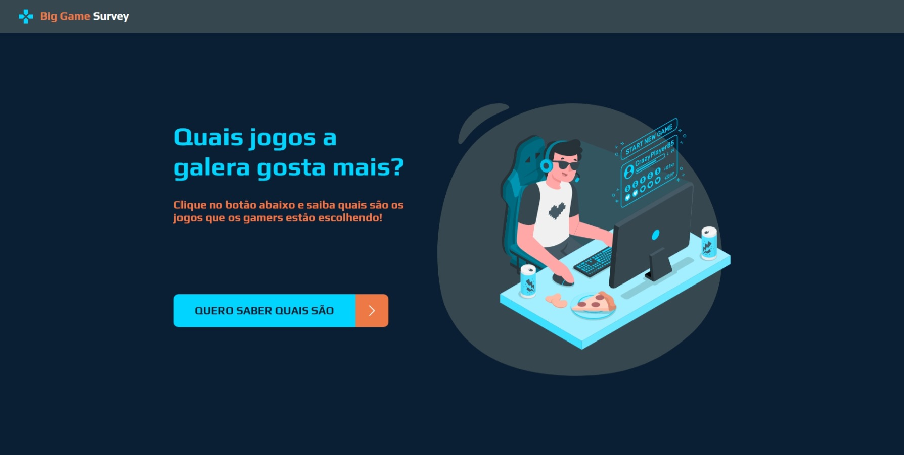
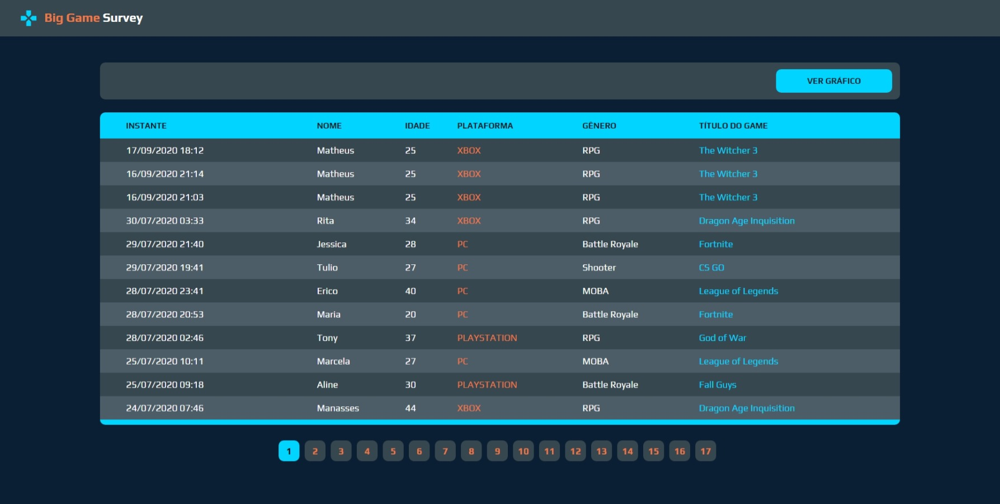
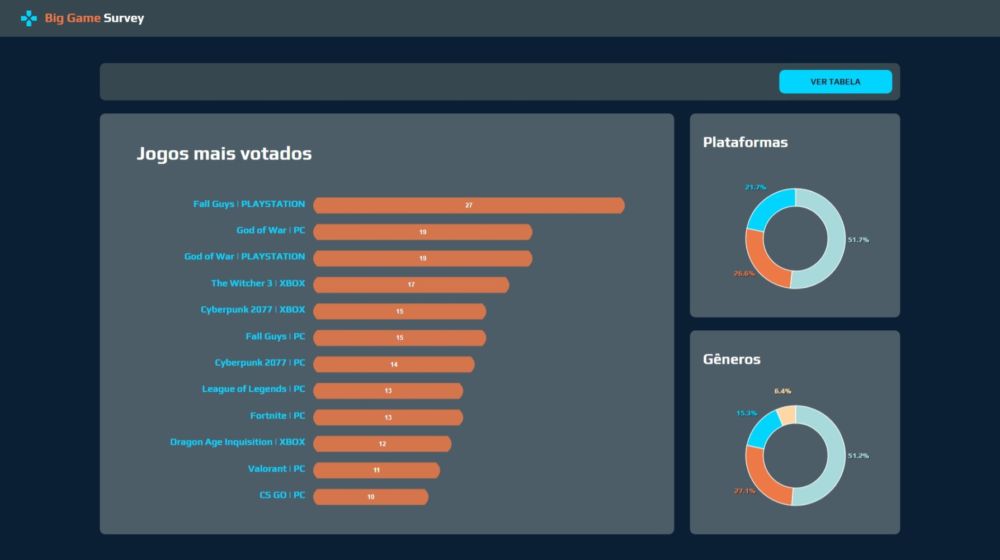

<h1 align="center">🎮 Big Game Survey</h1>

  <strong>App desenvolvido durante a 1ª edição do evento Semana DevSuperior</strong>
   
  O Projeto consiste em um sistema que mostra quais jogos a galera gosta mais. Foi utilizado Java com Spring Boot no Backend e TypeScript com ReactJs no Frontend

  

  

  

### Site 💻

- [Big Game Survey](https://sds1.vercel.app/)

## Biblioteca: 📙
- REACT
- REACT Native
